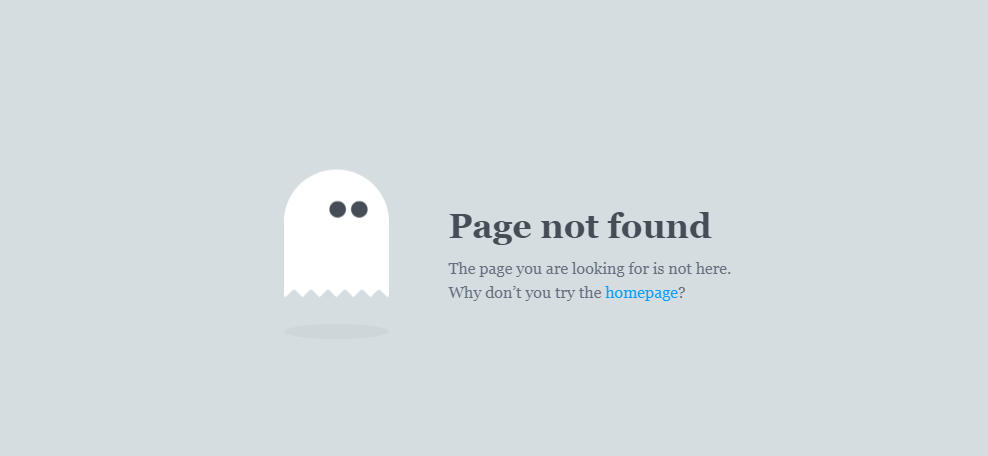

# 一个简单而有趣的404页面

本404页面裁剪于[推特用户 - 404 ghost](https://twitter.com/404_ghost) 的一个公开博客：[enstyled.com](https://enstyled.com/)。

原作者的GitHub主页：[https://github.com/enstyled](https://github.com/enstyled)。

---

原作者的网页经过`webpack`打包后，所有的`css`，`js`都各自放在一个文件中。

导致单独引用一个页面会非常臃肿，因此这里单独提供`404页面`所需要的资源文件。

#### 页面效果

一个幽灵会上下浮动，移动鼠标，幽灵的眼睛会跟着鼠标移动，望向鼠标所处位置。